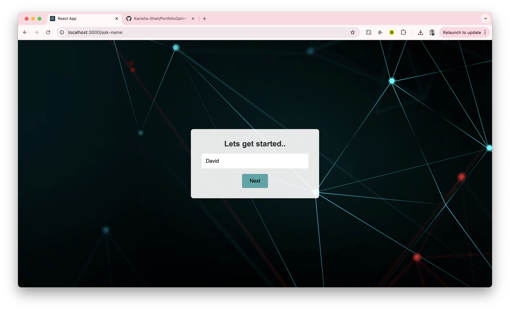
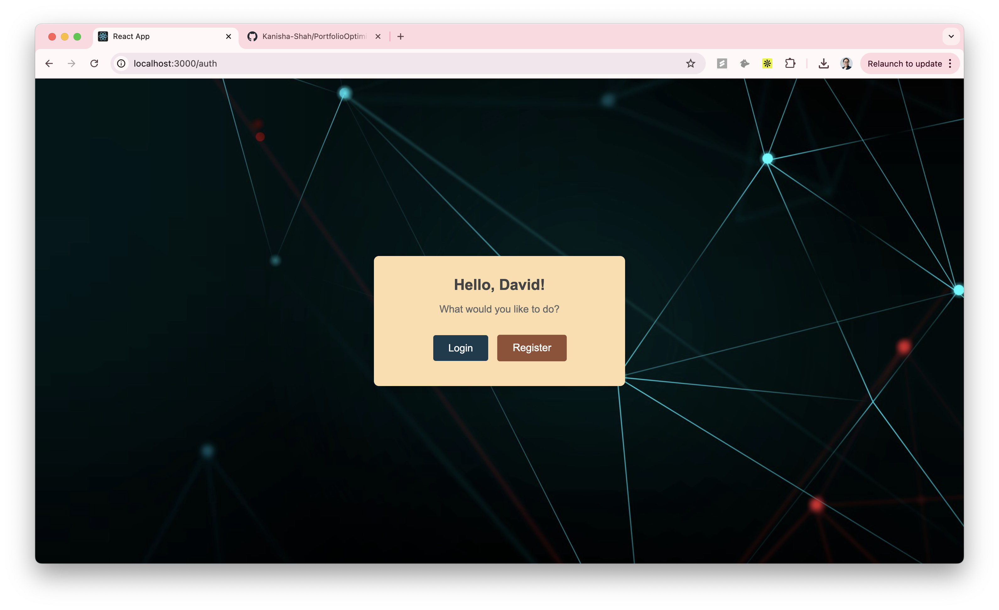
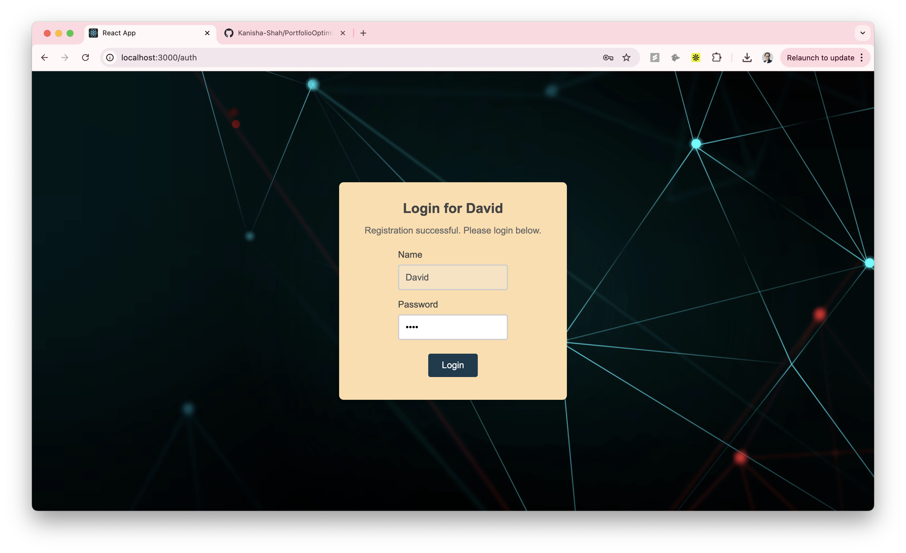
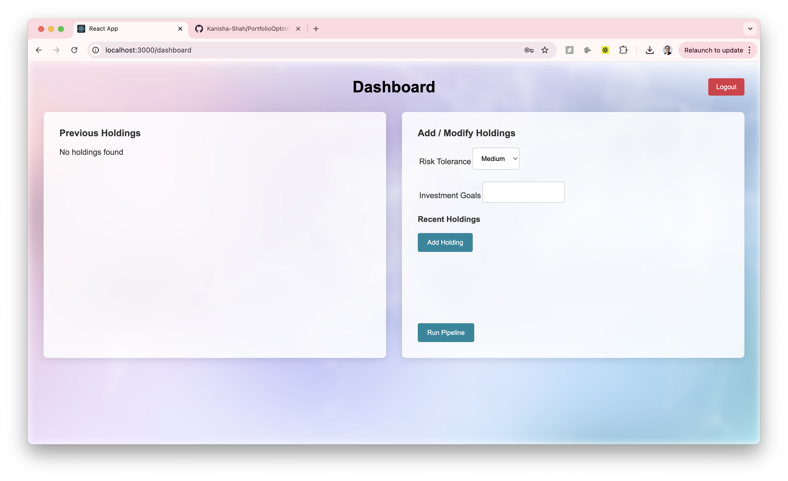
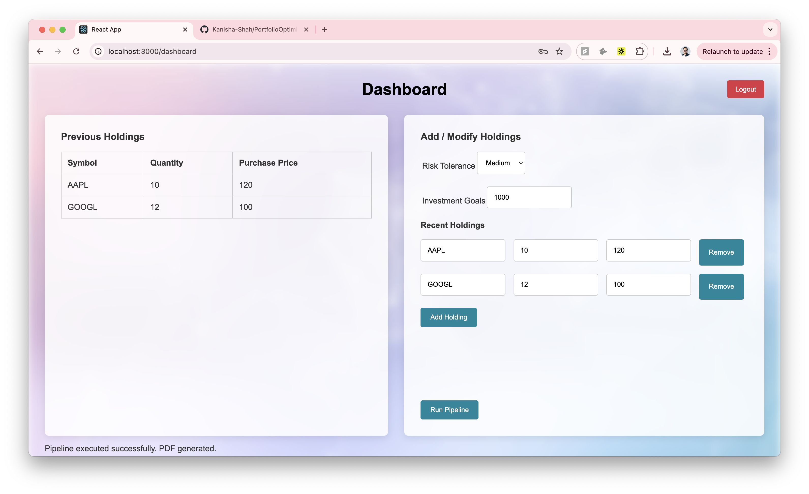
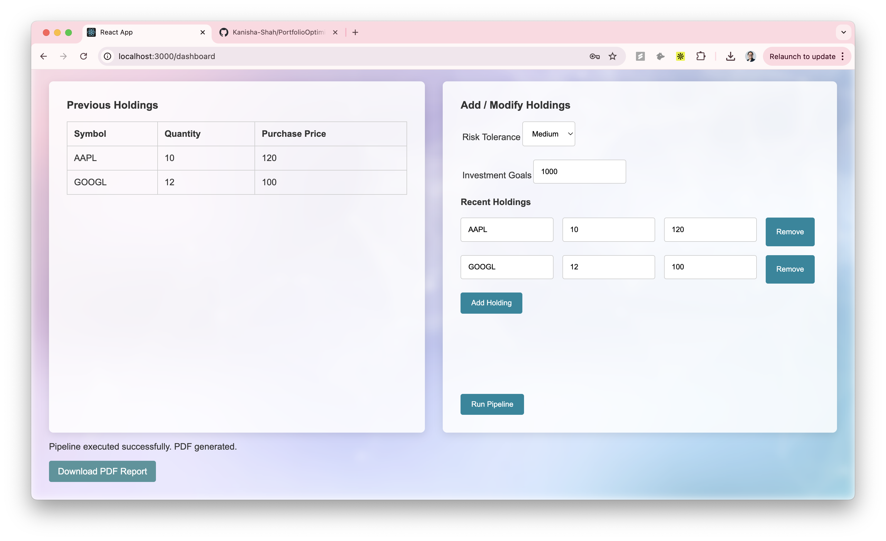
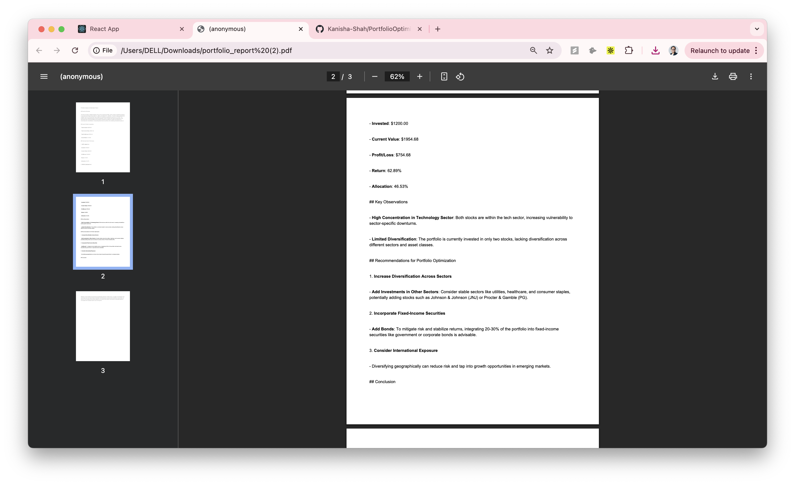

# Portfolio Optimization AI

The Portfolio Optimization AI Agent will:

- **Help users optimize their investment portfolios**
- **Provide risk-adjusted recommendations**
- **Use AI to analyze historical market data**
- **Simulate portfolio performance under different market conditions**
- **Support user-specific investment goals (growth, income, diversification, risk mitigation)**

This modular, agent-based approach aligns well with our vision of building a scalable and evolving system. Each agent has a single responsibility and is triggered in a sequence, ensuring that data is processed step by step.

## Key Features

### 1. User-Centric Portfolio Management
- Collects user-specific data such as risk tolerance, investment goals, and current holdings.
- Supports multiple asset types (stocks, bonds, ETFs, crypto, etc.).
- Maintains user history to track portfolio performance over time.

### 2. Agentic Pipeline
- **Market Data Collector Agent**
  - Fetches real-time prices and historical data from sources like Yahoo Finance.
- **Portfolio Analysis Agent**
  - Evaluates the user’s portfolio to compute profit/loss, allocation percentages, and overall risk metrics.
- **Optimization Agent (LLM-Powered)**
  - Generates risk-adjusted recommendations by crafting a prompt to a Large Language Model (LLM) and retrieving allocation strategies.
- **Report Generator Agent**
  - Summarizes analysis and optimization outputs into a user-friendly PDF (or HTML) report, leveraging LLMs for natural language explanations.

### 3. AI-Driven Insights
- Incorporates historical data to simulate performance under different market conditions.
- Suggests improvements and alternative allocations based on the user’s goals (e.g., growth, income, diversification, risk mitigation).

### 4. Modular Architecture
- Agents communicate in a sequence, each having a single responsibility.
- Easy to extend or replace agents as new data sources or optimization algorithms become available.
- Scalable design that can accommodate additional features (like sentiment analysis, advanced risk models, or real-time alerts).

### 5. LLM Integration
- Uses prompt engineering to feed the Portfolio Analysis output into the Optimization Agent’s LLM.
- Returns detailed recommendations, rationales, and next steps in natural language.

## Agentic Pipeline: Detailed Flow

1. **Market Data Collector Agent**
   - Uses yfinance (or similar) to fetch the latest quotes and historical data for each holding.
   - Provides an up-to-date snapshot of the market, ensuring accurate calculations in the next stage.
2. **Portfolio Analysis Agent**
   - Reads the user’s portfolio (e.g., symbols, quantities, purchase prices) and current market data.
   - Calculates profit/loss, allocation percentages, risk metrics, and sector/asset class breakdowns.
3. **Optimization Agent (LLM-Powered)**
   - Takes the analysis results, user’s risk tolerance, and goals to form a prompt for a Large Language Model.
   - Receives a recommended allocation strategy, explaining how to adjust holdings for improved returns, lower risk, or balanced growth.
4. **Report Generator Agent**
   - Combines analysis and optimization results into a one-page summary.
   - Leverages the LLM for a natural language write-up, then converts it to a PDF or HTML file for user download.

## How Users Interact

1. **Register/Login**
   - Users create an account or log in, storing their name, risk tolerance, and any relevant preferences.
   - Authentication is handled via JWT tokens for secure access.

2. **Provide Portfolio Data**
   - Users input their holdings (symbol, quantity, purchase price).
   - The system fetches the latest market data on demand.

3. **Run Pipeline**
   - A single “Optimize Portfolio” action triggers the agentic pipeline:
     1. Collects fresh market data.
     2. Analyzes current holdings (profit/loss, risk).
     3. Optimizes based on user risk tolerance, goals, and LLM suggestions.
     4. Generates a comprehensive report.
   

4. **Download Report**
   - Users receive a PDF or HTML summary detailing the portfolio’s performance, recommended changes, and rationale.

